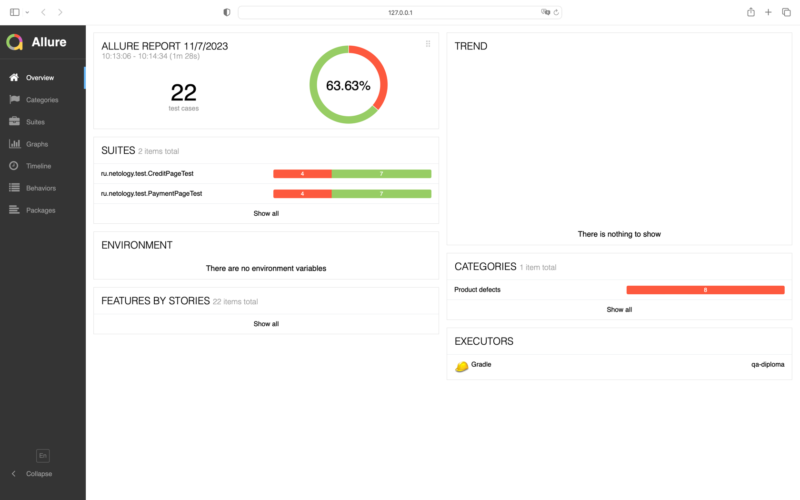

# Отчет о проведенном тестировании

## Краткое описание и количество тест-кейсов:
Всего в дипломной работе мною было написано 22 автоматизированных тест-кейсов, из них 10 - это UI-тесты, а также 6 - запись о транзакциях в MySQL и 6 - запись о транзакциях в PostgreSQL.
В процессе тестирования мною также были заведены 7 баг-репортов на дефекты из сгенерированных Allure и Gradle отчетам.

## Процент успешных и не успешных тест-кейсов:
В процентном соотношении успешные и не успешные тест-кейсы составляют: 
- 50% - успешные тесты; 
- 20% - не успешные тесты; 
- 30% - это тесты, которые не поддерживаются определенной СУБД.

## Отчеты:

## Общие рекомендации:
Есть критичный баг, который следовало бы исправить сразу - это то, что с карты списывается очень большая сумма денег.
Также не выводится ошибка при отправке данных по отклоненной карте.